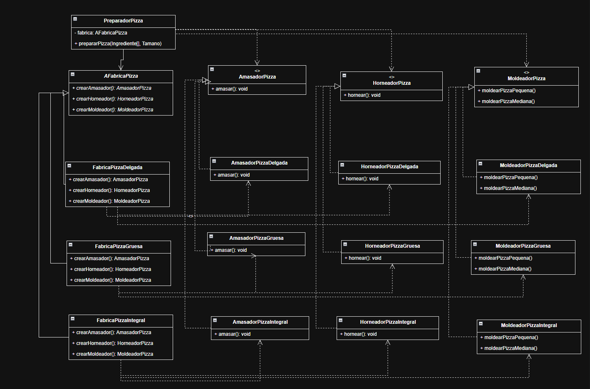

# Desarrollo-de-Software
# Taller de Patrones Creacionales — Fábrica Abstracta

## Trabajo en pareja

- **Nicolás Salazar** — Parte I: Fábrica de Pizzas
- **Tiffany Cardona** — Parte II: Refactorización del juego

Parte I: https://github.com/Nickjjlkm/Desarrollo-de-Software
Parte II: https://github.com/Nickjjlkm/DYAS-GoF-CreationalPatterns-GameRefactoring

### Parte I: Fábrica de Pizzas

Universidad de La Sabana
Diseño y Arquitectura de Software

**Estudiante:** Nicolás Salazar
**Código:** 337434
**Profesor:** César A. Vega F.

Agosto de 2026

---

Refactorización de una máquina de pizzas cuyo proceso de preparación estaba
acoplado a un único tipo de masa. Se aplica el patrón Fábrica Abstracta para
que la secuencia de preparación —amasar, moldear, aplicar ingredientes y
hornear— quede independiente de la variante de masa que produzca la máquina,
permitiendo agregar nuevas variantes sin modificar el código del preparador.

## Modelo de clases

`PreparadorPizza` solo se relaciona con `AFabricaPizza` y con las tres
interfaces de producto. Cada fábrica concreta produce la terna completa de su
familia, de modo que agregar una variante nueva no obliga a modificar la
lógica de preparación.

Las evidencias de ejecución están en [EVIDENCIAS.md](EVIDENCIAS.md).
